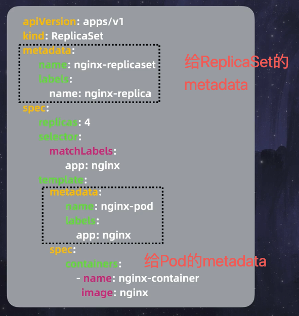

# 入门k8s

教学视频地址: https://www.bilibili.com/video/BV1gj411E7W3/?spm_id_from=333.999.0.0&vd_source=e339d0ca63ebabe15afcd98b996033f7

## 环境准备

使用Docker Desktop安装k8s环境


## 入门命令

```shell
# 当前集群的一个节点
lilithgames@lilithgamesdeMacBook-Pro-5 k8s % kubectl get nodes
NAME             STATUS   ROLES           AGE   VERSION
docker-desktop   Ready    control-plane   84m   v1.29.1
lilithgames@lilithgamesdeMacBook-Pro-5 k8s % 

# 创建pod 名称: guy 镜像: busybox 
# -i: 交互模式
# --tty: 分配一个终端
# --image: 镜像
lilithgames@lilithgamesdeMacBook-Pro-5 k8s % kubectl run guy -i --tty --image=busybox
If you don't see a command prompt, try pressing enter.
/ # 
/ # 
/ # 
```

等上面创建pod成功后, 执行下面的命令查看pod状态

```shell
# 查看pod状态
lilithgames@lilithgamesdeMacBook-Pro-5 k8s % kubectl get pods 
NAME   READY   STATUS    RESTARTS   AGE
guy    1/1     Running   0          2m58s
```

如果此时使用docker ps查看, 也能够看到容器的状态

```shell
lilithgames@lilithgamesdeMacBook-Pro-5 k8s % docker ps
CONTAINER ID   IMAGE     COMMAND   CREATED         STATUS         PORTS     NAMES
f3f989946946   busybox   "sh"      4 minutes ago   Up 4 minutes             k8s_guy_guy_default_1a4eb5ba-8798-4213-b963-2929340968ed_0
lilithgames@lilithgamesdeMacBook-Pro-5 k8s % 
```

这里我们没有使用docker去创建容器, 而是使用k8s去和容器运行时进行交互, 创建容器 

## 编写yaml文件

### pod.yaml

对应yaml文件位于: k8s/yaml/pod.yaml

```yaml
apiVersion: v1
kind: Pod  # 资源类型 
metadata: # 填写关于这个对象的标识
  name: nginx-pod # 对象的名字
  labels: # 对象的标签
    app: nginx
spec: # 定义这个对象的规格
  containers: # 容器列表
  - name: nginx-container # 容器的名字
    image: nginx # 容器的镜像
```

然后在k8s文件夹目录下的终端中执行下面的命令

```shell
lilithgames@lilithgamesdeMacBook-Pro-5 k8s % kubectl create -f ./yaml/pod.yaml 
pod/nginx-pod created
lilithgames@lilithgamesdeMacBook-Pro-5 k8s % kubectl get pods                 
NAME        READY   STATUS    RESTARTS   AGE
guy         1/1     Running   0          20m
nginx-pod   1/1     Running   0          24s
lilithgames@lilithgamesdeMacBook-Pro-5 k8s % 
```

这里就可以看到新增的nginx-pod, 并且状态是runninng

现在我们删除掉“guy”这个pod

```shell
lilithgames@lilithgamesdeMacBook-Pro-5 k8s % kubectl delete pods guy
pod "guy" deleted
```
然后再次查看pod状态, 发现“guy”已经不存在了

```shell
lilithgames@lilithgamesdeMacBook-Pro-5 k8s % kubectl get pods
NAME        READY   STATUS    RESTARTS   AGE
nginx-pod   1/1     Running   0          2m19s
```             

这样的部署,就像一次性的操作, 无法进行持续的维护 

### ReplicaSet.yaml

> 解释: 简单理解ReplicaSet, 就是pod的副本集, 用于管理pod的副本

> 作用: 不是拥有pod,而是维持pod的副本数量, 并且可以动态的调整pod的数量

对应yaml文件位于: k8s/yaml/ReplicaSet.yaml

图片解释这里的配置:


设置selector, 指定pod的标签


拷贝上面的pod.yaml文件的metadata和spec部分, 粘贴到ReplicaSet.yaml文件的模版template中, 用于告诉ReplicaSet, 创建这样template(模版)的pod就可以


创建的pod标签要和我们selector的标签保持一致, 否则无法创建pod



搞清楚到底是谁的metadata, 最上面的是给RepliacSet的, 下面的是给模版pod的

```yaml
apiVersion: apps/v1 # 版本号
kind: ReplicaSet # 资源类型
metadata: # 填写关于这个对象的标识
  name: nginx-replicaset # 对象的名字
  labels: # 注意: ** 这里的labels只是用在这个ReplicaSet上的, 而不是用在某个Pod上的labels **
    name: nginx-replica
spec: # 定义这个对象的规格
  replicas: 4 # 副本数
  selector: # 选择器
    matchLabels: # 匹配标签
      app: nginx
  template: # 模板 (这里直接拷贝前面的pod.yaml中的metadata和spec部分)
    metadata: # 填写关于这个对象的标识
      name: nginx-pod # 对象的名字
      labels: # 对象的标签
        app: nginx
    spec: # 定义这个对象的规格
      containers: # 容器列表
      - name: nginx-container # 容器的名字
        image: nginx # 容器的镜像
```

现在在k8s文件夹目录下的终端中执行下面的命令:

```shell
lilithgames@lilithgamesdeMacBook-Pro-5 k8s % kubectl get pods
NAME        READY   STATUS    RESTARTS   AGE
nginx-pod   1/1     Running   0          24m
lilithgames@lilithgamesdeMacBook-Pro-5 k8s % 
```

首先查看一下pod状态, 发现只有一个nginx-pod

```shell
lilithgames@lilithgamesdeMacBook-Pro-5 k8s % kubectl create -f ./yaml/ReplicaSet.yaml 
replicaset.apps/nginx-replicaset created
lilithgames@lilithgamesdeMacBook-Pro-5 k8s % 
```

然后执行创建ReplicaSet的命令, 发现会存在4个pod, 新增了3个pod

```shell
lilithgames@lilithgamesdeMacBook-Pro-5 k8s % kubectl get pods
NAME                     READY   STATUS    RESTARTS   AGE
nginx-pod                1/1     Running   0          27m
nginx-replicaset-fhlrs   1/1     Running   0          27s
nginx-replicaset-fxlmq   1/1     Running   0          27s
nginx-replicaset-jhgtd   1/1     Running   0          27s
lilithgames@lilithgamesdeMacBook-Pro-5 k8s % 
```

如果有不同的ReplicaSet, 还可以通过下面的命令来查看

```shell
lilithgames@lilithgamesdeMacBook-Pro-5 k8s % kubectl get rs
NAME               DESIRED   CURRENT   READY   AGE
nginx-replicaset   4         4         4       2m35s
lilithgames@lilithgamesdeMacBook-Pro-5 k8s % 
```

如果不想通过修改ReplicaSet的yaml文件来修改副本集的数量, 可通过下面的命令临时修改

```shell
lilithgames@lilithgamesdeMacBook-Pro-5 k8s % kubectl scale --replicas=5  -f ./yaml/ReplicaSet.yaml 
replicaset.apps/nginx-replicaset scaled
lilithgames@lilithgamesdeMacBook-Pro-5 k8s % kubectl get pods                                     
NAME                     READY   STATUS              RESTARTS   AGE
nginx-pod                1/1     Running             0          65m
nginx-replicaset-fhlrs   1/1     Running             0          38m
nginx-replicaset-fxlmq   1/1     Running             0          38m
nginx-replicaset-jhgtd   1/1     Running             0          38m
nginx-replicaset-rsz5w   0/1     ContainerCreating   0          4s
```

现在我们尝试把最后的一个pod删除, 会发现ReplicaSet会重新创建一个pod ( nginx-replicaset-x2jtb ), 如下的最后一个pod

```shell
lilithgames@lilithgamesdeMacBook-Pro-5 k8s % kubectl delete pods nginx-replicaset-rsz5w
pod "nginx-replicaset-rsz5w" deleted
lilithgames@lilithgamesdeMacBook-Pro-5 k8s % 
lilithgames@lilithgamesdeMacBook-Pro-5 k8s % 
lilithgames@lilithgamesdeMacBook-Pro-5 k8s % kubectl get pods                          
NAME                     READY   STATUS              RESTARTS   AGE
nginx-pod                1/1     Running             0          67m
nginx-replicaset-fhlrs   1/1     Running             0          40m
nginx-replicaset-fxlmq   1/1     Running             0          40m
nginx-replicaset-jhgtd   1/1     Running             0          40m
nginx-replicaset-x2jtb   0/1     ContainerCreating   0          2s
lilithgames@lilithgamesdeMacBook-Pro-5 k8s % 
```

为了方便后续学习, 删除ReplicaSet

```shell
lilithgames@lilithgamesdeMacBook-Pro-5 k8s % kubectl delete rs nginx-replicaset 
replicaset.apps "nginx-replicaset" deleted
lilithgames@lilithgamesdeMacBook-Pro-5 k8s % kubectl get pods                   
No resources found in default namespace.
lilithgames@lilithgamesdeMacBook-Pro-5 k8s % 
```

## Deploment

### 初识Deployment


> 作用: 为了让版本更新更加方便, 有了Deployment

> 解释: 简单说, Deployment就是ReplicaSet的升级版, 创建Deploment, 它会创建ReplicaSet, 创建ReplicaSet他会创建pod

首先在k8s文件夹下创建deployment.yaml文件:

这里相较于ReplicaSet的yaml文件, 修改了:
1. kind: Deployment # 资源类型
2. name: nginx-deployment # 对象的名字
3. name: nginx-deployment

```yaml
apiVersion: apps/v1 # 版本号
kind: Deployment # 资源类型
metadata: # 填写关于这个对象的标识
  name: nginx-deployment # 对象的名字
  labels: 
    name: nginx-deployment
spec: # 定义这个对象的规格
  replicas: 4 # 副本数
  selector: # 选择器
    matchLabels: # 匹配标签
      app: nginx
  template: # 模板 (这里直接拷贝前面的pod.yaml中的metadata和spec部分)
    metadata: # 填写关于这个对象的标识
      name: nginx-pod # 对象的名字
      labels: # 对象的标签
        app: nginx
    spec: # 定义这个对象的规格
      containers: # 容器列表
      - name: nginx-container # 容器的名字
        image: nginx # 容器的镜像
```

然后在k8s文件夹下执行下面的命令

```shell
lilithgames@lilithgamesdeMacBook-Pro-5 k8s % kubectl create -f ./yaml/Deployment.yaml 
deployment.apps/nginx-deployment created
lilithgames@lilithgamesdeMacBook-Pro-5 k8s % 
```

通过命令查看Delpoyment

```shell  
lilithgames@lilithgamesdeMacBook-Pro-5 k8s % kubectl get deployments
NAME               READY   UP-TO-DATE   AVAILABLE   AGE
nginx-deployment   4/4     4            4           112s
lilithgames@lilithgamesdeMacBook-Pro-5 k8s % 
```

通过命令也可以查看ReplicaSet, 毕竟在Deployment.yaml中声明了replicas: 4, 所以会创建4个ReplicaSet

```shell  
lilithgames@lilithgamesdeMacBook-Pro-5 k8s % kubectl get rs
NAME                         DESIRED   CURRENT   READY   AGE
nginx-deployment-7d87f8ffc   4         4         4       4m3s
lilithgames@lilithgamesdeMacBook-Pro-5 k8s % 
```

通过命令查看pod

```shell  
lilithgames@lilithgamesdeMacBook-Pro-5 k8s % kubectl get pods
NAME                               READY   STATUS    RESTARTS   AGE
nginx-deployment-7d87f8ffc-6828v   1/1     Running   0          7m49s
nginx-deployment-7d87f8ffc-ndvxr   1/1     Running   0          7m49s
nginx-deployment-7d87f8ffc-pcwmg   1/1     Running   0          7m49s
nginx-deployment-7d87f8ffc-vfsnf   1/1     Running   0          7m49s
lilithgames@lilithgamesdeMacBook-Pro-5 k8s % 
```

这里注意, Deployment -> ReplicaSet -> Pod, 他们的Name是层层递进的

### 更新Deployment

我们使用命令可以查看Deployment的详细信息: nginx%表示镜像版本

```shell  
lilithgames@lilithgamesdeMacBook-Pro-5 k8s % kubectl get deployments nginx-deployment -o jsonpath="{..image}"
nginx%                                                 
lilithgames@lilithgamesdeMacBook-Pro-5 k8s % 
```

现在我们更新之前的Deploment.yaml文件的最后一行为: **nginx:1.25.3 # 修改新版本**

```yaml
apiVersion: apps/v1 # 版本号
kind: Deployment # 资源类型
metadata: # 填写关于这个对象的标识
  name: nginx-deployment # 对象的名字
  labels: 
    name: nginx-deployment
spec: # 定义这个对象的规格
  replicas: 4 # 副本数
  selector: # 选择器
    matchLabels: # 匹配标签
      app: nginx
  template: # 模板 (这里直接拷贝前面的pod.yaml中的metadata和spec部分)
    metadata: # 填写关于这个对象的标识
      name: nginx-pod # 对象的名字
      labels: # 对象的标签
        app: nginx
    spec: # 定义这个对象的规格
      containers: # 容器列表
      - name: nginx-container # 容器的名字
        image: nginx:1.25.3 # 修改新版本
```

使用apply命令更新Deployment

```shell  
lilithgames@lilithgamesdeMacBook-Pro-5 k8s % kubectl apply -f ./yaml/Deployment.yaml 
Warning: resource deployments/nginx-deployment is missing the kubectl.kubernetes.io/last-applied-configuration annotation which is required by kubectl apply. kubectl apply should only be used on resources created declaratively by either kubectl create --save-config or kubectl apply. The missing annotation will be patched automatically.
deployment.apps/nginx-deployment configured
lilithgames@lilithgamesdeMacBook-Pro-5 k8s % 
```

可以看到这里报错了, 因为之前用create, 现在用apply, 会缺失一些标注.

虽然apply表面是应用的意思, 但是实际上还会执行更新操作.

```shell
lilithgames@lilithgamesdeMacBook-Pro-5 k8s % kubectl get deployments nginx-deployment -o jsonpath="{..image}"
nginx:1.25.3% 
lilithgames@lilithgamesdeMacBook-Pro-5 k8s % 
```

再次运行命令查看Deployment, 可以看到镜像版本已经更新为1.25.3

### 访问篇

现在我们知道了各种部署方式, 如下可以看到创建的pod也是在运行

```shell  
lilithgames@lilithgamesdeMacBook-Pro-5 k8s % kubectl get pods                                                
NAME                                READY   STATUS    RESTARTS   AGE
nginx-deployment-5fb9b9cc6d-569d6   1/1     Running   0          3m55s
nginx-deployment-5fb9b9cc6d-8g8tn   1/1     Running   0          4m13s
nginx-deployment-5fb9b9cc6d-cf5cz   1/1     Running   0          4m13s
nginx-deployment-5fb9b9cc6d-l97jh   1/1     Running   0          3m58s
lilithgames@lilithgamesdeMacBook-Pro-5 k8s % 
```

但是为什么却访问不了localhsot:8080呢?


其实是pod躲在了集群里面


## Service

入门Service需要知道两个概念:
1. [对内]集群内分配IP地址, 且地址只在集群内使用: ClusterIP (默认)
2. [对外]节点暴露端口, 使得外部可访问: NodePort
3. LoadBalancer(暂时不用)
4. ExternalName(暂时不用)

配置Service.yaml: 位于./yaml/Service.yaml

```yaml
apiVersion: v1
kind: Service
metadata: 
  name: external-service # 对象的名字
spec: 
  type: NodePort # 暴露方式
  selector: # 选择器
    app: nginx
  ports: # 端口列表
  - port: 80 # 对应Service的端口号
    targetPort: 80 # 目标Pod的端口号
    nodePort: 30001 # 对外暴露的端口号
```


简单解释一下, 外面的流量要进来节点, 需要暴露nodePort端口号, 接着交给Service处理, Service也可以有很多端口, 因此需要设定一下特定的端口号port, 最后包裹容器的Pod也有自己的端口号, 因此还得设置下targetPort.
1. 经常看到port和targetPort设置成一样的, 这是为了方便, 也可以分开写
2. nodePort端口号有范围要求, 范围是30000-32767

下面通过命令来查看Service

```shell  
lilithgames@lilithgamesdeMacBook-Pro-5 k8s % kubectl get services
NAME         TYPE        CLUSTER-IP   EXTERNAL-IP   PORT(S)   AGE
kubernetes   ClusterIP   10.96.0.1    <none>        443/TCP   3h50m
lilithgames@lilithgamesdeMacBook-Pro-5 k8s % 
```

这是创建集群的时候就存在的

下面来创建Service

```shell  
lilithgames@lilithgamesdeMacBook-Pro-5 k8s % kubectl create -f ./yaml/Service.yaml 
service/external-service created
lilithgames@lilithgamesdeMacBook-Pro-5 k8s % 
```

再次查看Service

```shell  
lilithgames@lilithgamesdeMacBook-Pro-5 k8s % kubectl get services                 
NAME               TYPE        CLUSTER-IP    EXTERNAL-IP   PORT(S)        AGE
external-service   NodePort    10.96.80.10   <none>        80:30001/TCP   15s
kubernetes         ClusterIP   10.96.0.1     <none>        443/TCP        3h52m
lilithgames@lilithgamesdeMacBook-Pro-5 k8s % 
```

此时再去浏览器访问http://localhost:30001/, 就能发现可以访问了

而这里的30001端口就是在Service.yaml中设置的nodePort端口号


