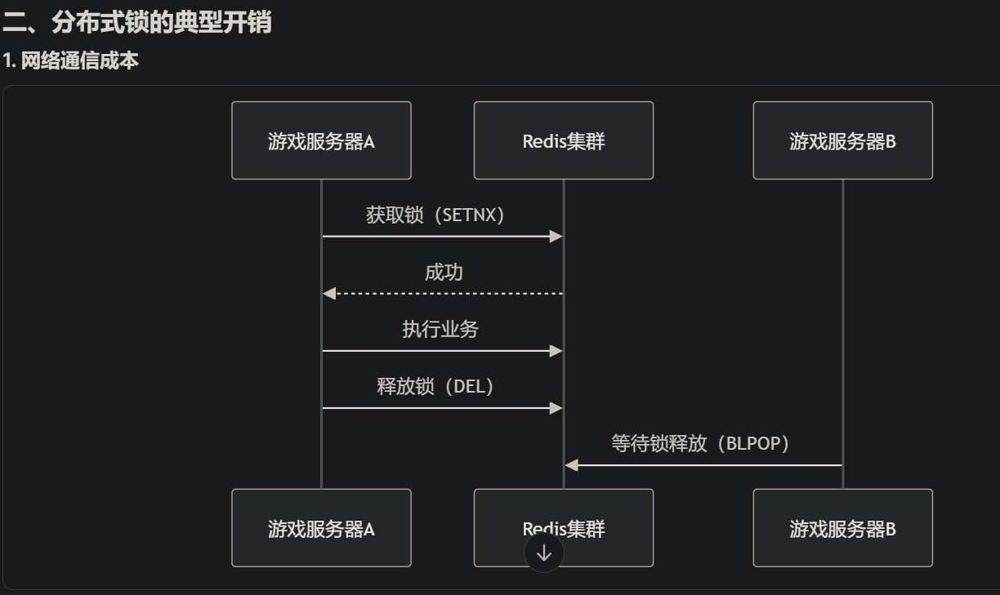
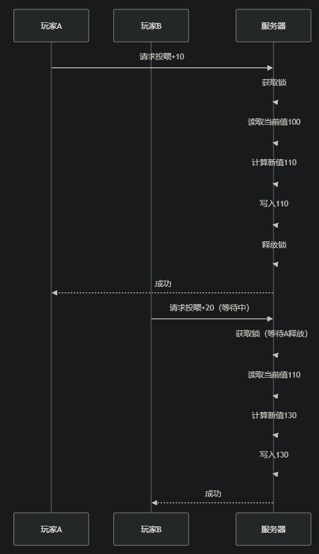
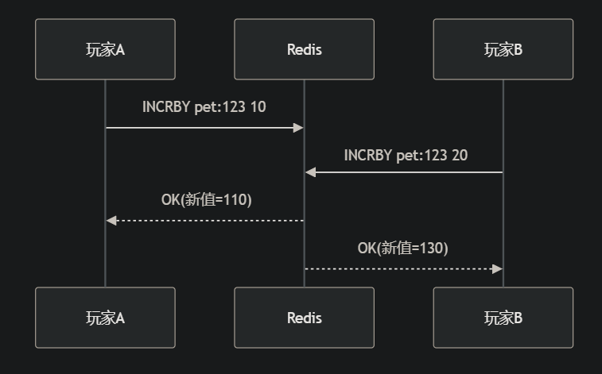

## 主要解读redis连接池的参数

```
rdb := redis.NewClient(&redis.Options{
    PoolSize:     100,      // 最大活跃连接数(客户端最多能建立多少个连接)
    MinIdleConns: 20,       // 最小保持空闲连接数
    PoolTimeout:  30 * time.Second, // 获取连接的超时时间（进行连接时，多久会连接超市，导致连接失败）
    IdleTimeout:  5 * time.Minute,  // 空闲连接保留时间（单个连接多长时间没有连接会断开）
})
```


## 分布式锁和乐观锁
分布式锁与乐观锁的核心区别与差异

> 分布式锁：（比如reids的SETNX）

定义：一种跨进程或跨节点的锁机制，用于协调分布式系统中多个实例对共享资源的访问，确保同一时刻只有一个实例能操作资源。

目标：解决分布式环境下资源的互斥访问问题，例如防止多个节点同时修改同一数据或执行重复任务（如库存扣减、定时任务调度） 

> 乐观锁:（redis提供的watch方案，可参看redis_watch.go）

定义：一种无锁机制，假设并发冲突概率低，仅在数据提交时通过版本号或条件判断检查数据是否被修改。

目标：在避免加锁的情况下保证数据一致性，适用于读多写少的高并发场景（如商品库存更新、账户余额扣减）


### 分布式锁在游戏中过重度 

分布式锁在游戏中被视为重度操作 的主要原因是游戏场景对实时性 和高并发 的苛刻要求，以及分布式锁自身特性所带来的性能损耗。以下是具体分析：





## 最佳实践

https://lilithgames.feishu.cn/wiki/Tfvdw4sj8ikbYckydTWciZ8Vnog

解读文章：
1. 作者在完成“玩家组队喂宠物”的需求中，比如该需求会涉及到“宠物养成值更新”的处理
2. 由于分布式锁（悲观锁）是会存在绝对互斥，高冲突概率（比如玩家A和玩家B同时投喂时，玩家B需要等A数据操作更新完，才能投喂，显然不行）
3. 所以此时采用乐观锁是最好的，保证游戏功能的高频低冲突特性以及性能优化的需求

对比如下：

分布式锁（悲观锁）：



乐观锁：



4. 所以作者一开始使用redis的watch（乐观锁）来实现，但是通过查询IO操作记录，发现redis的watchIO操作为6次IO（单次操作），而分布式锁才4次

5. 所以改进了乐观锁的方案，改为使用lua + 重试的乐观锁方案，使用lua读写redis的原子性，在进行redis操作时，使用lua脚本，做到只有一次IO操作的优化
