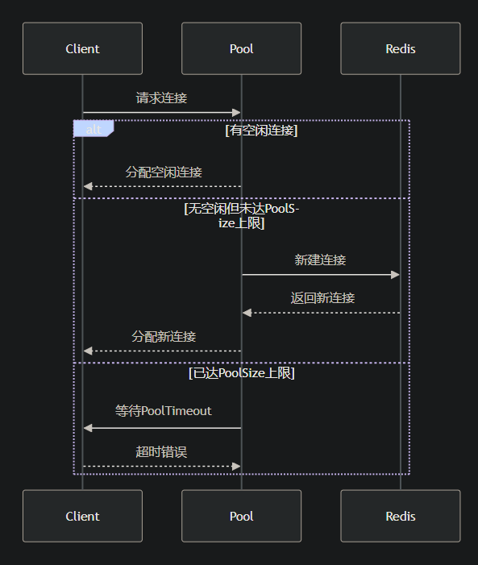

## 主要解读redis连接池的参数

```
rdb := redis.NewClient(&redis.Options{
    PoolSize:     100,      // 最大活跃连接数(客户端最多能建立多少个连接)
    MinIdleConns: 20,       // 最小保持空闲连接数
    PoolTimeout:  30 * time.Second, // 获取连接的超时时间（进行连接时，多久会连接超市，导致连接失败）
    IdleTimeout:  5 * time.Minute,  // 空闲连接保留时间（单个连接多长时间没有连接会断开）
})
```


